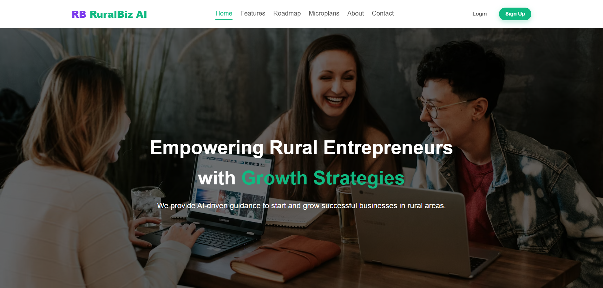
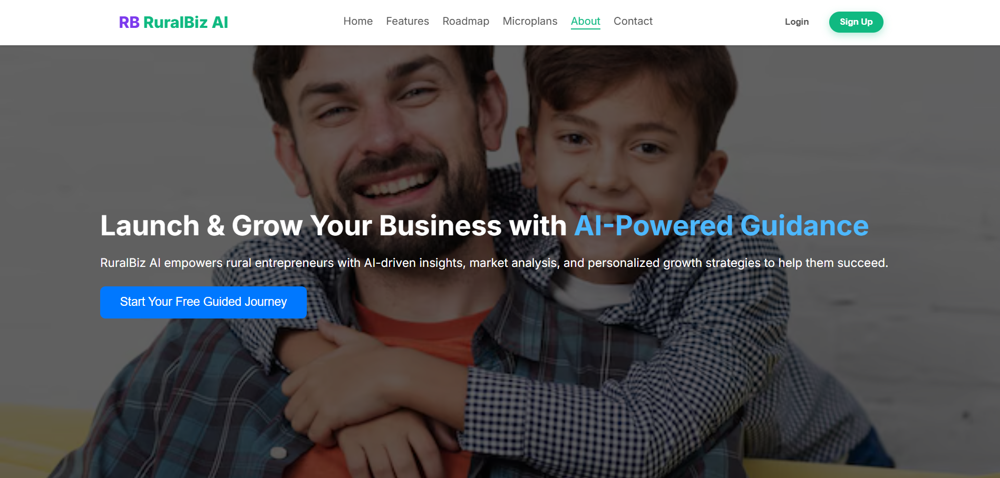
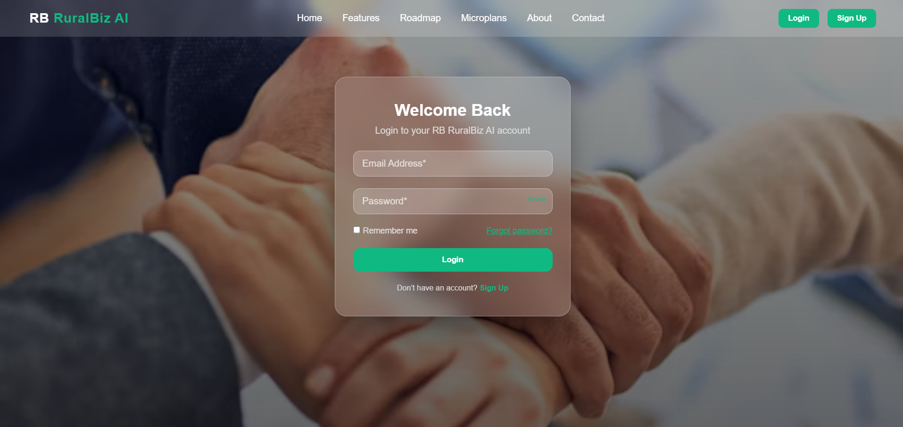
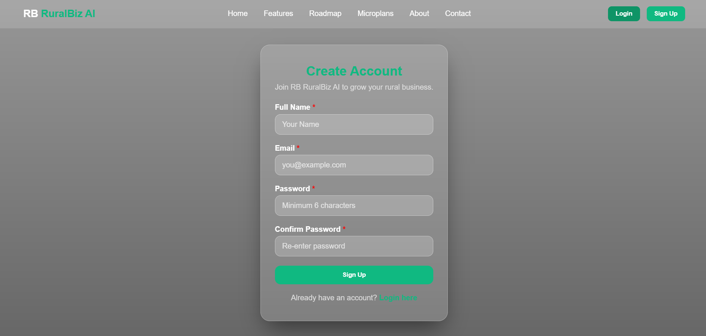

# Rural Edge – Empowering Rural Entrepreneurs with AI

## 📑 Table of Contents
- [Project Overview](#project-overview)
- [Features](#features)
- [Tech Stack](#tech-stack)
- [AI / Tools Used](#ai--tools-used)
- [Project Structure](#project-structure)
- [Installation & Usage](#installation--usage)
- [Screenshots](#screenshots)
- [Team / Contributors](#team--contributors)
- [License](#license)

## 🌟 Project Overview

Rural Edge is a web-based platform designed to support rural entrepreneurs and small businesses.
It helps them with business guidance, resource accessibility, mentorship, and market insights using AI-powered recommendations.

The goal is to bridge the gap between rural business ideas and real-world execution.

AI tools were used to assist in business idea validation and market research.

---

## 🚀 Features

* 🧭 AI Business Guidance – Get tailored suggestions for your business idea.
* 📊 Market Insights – Access simplified reports about trends and opportunities.
* 🏫 Entrepreneurship Resources – Learn through guides, blogs, and toolkits.
* 🤝 Mentorship Connect – Connect with experts and successful entrepreneurs.
* 📍 Local Resource Finder – Helps locate nearby support centers and govt schemes.

---

## 🛠 Tech Stack

* Frontend

* HTML5 – Defines the structure and content of each page (index.html, features.html, roadmap.html, etc.).

* CSS3 – Handles page styling, with separate CSS files for each page (stored in the css/ folder) to keep styles modular and easy to maintain.

* JavaScript (ES6) – Adds interactivity and dynamic functionality, organized by page in the js/ folder for better scalability and performance.

---

## 🤖 AI / Tools Used

* ChatGPT / Gemini API – Used to generate business guidance, suggestions, and market insights for entrepreneurs.

---

## 📂 Project Structure

RuralBiz-AI/
│── index.html
│── features.html
│── roadmap.html
│── microplans.html
│── about.html
│── contact.html
│── login.html
│── sign-up.html
│
├── css/
│   ├── style.css
│   ├── features.css
│   ├── roadmap.css
│   ├── microplans.css
│   ├── about.css
│   ├── contact.css
│   ├── login.css
│   └── sign-up.css
│
│── js/
│   ├── home.js
│   ├── features.js
│   ├── roadmap.js
│   ├── microplans.js
│   ├── about.js
│   ├── contact.js
│   ├── login.js
│   └── sign-up.js
│
│── /Asset
│── README.md

---

## ⚙ Installation & Usage

1. Download or clone the repository.

   bash
   
   
2. Open index.html in your browser.
3. Explore the platform.

---
## 🌐 Live Demo

Check out the live website here:  

---
## 📸 Screenshots

### Home Page

### About Page

### Login page

### Sign-Up Page

---

## 🙌 Team / Contributors

* SHIVAM JAISWAL – Developer
* BHOOMI KESHARWANI - Developer

---

## 📜 License

This project is created for Hackathon/Competition purposes and is open for educational use.

---#